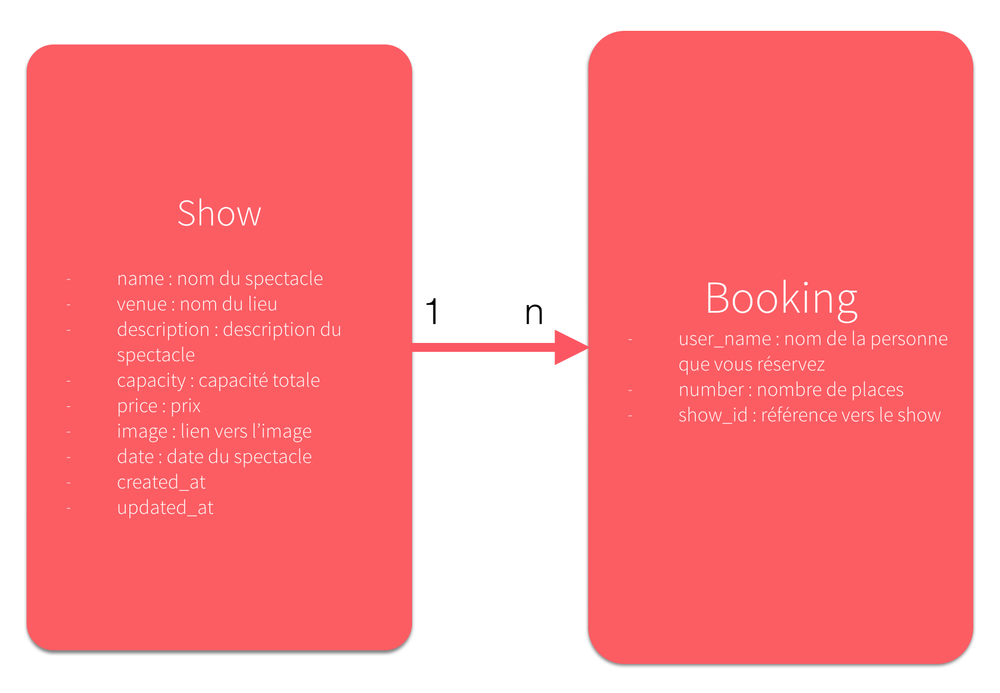

Workshop X - Cours #3
=======

Objectifs de l'atelier :

* Finaliser l'API en ajoutant une notion de réservation (Booking)
* Déployer l'application sur Heroku

Prérequis :

* Atelier 2 réalisé. Nous allons continuer sur la même base, quelque soit la base de données utilisée (mysql ou sqlite)

# Préambule

Contrairement au cours précédent où nous avons utilisé un scaffold, nous allons cette fois générer un modèle, puis les méthodes et les routes dont nous avons besoin à la main.



Comme vous pouvez le voir sur ce schéma, nous allons créer un modèle Booking correspondant à la réservation que l'on veut réaliser. Quand l'utilisateur voudra réserver, il mettra son nom et le nombre de places qu'il veut et réservera.
Concrètement dans le code, ça veut dire plusieurs choses :

* On va avoir une relation entre nos Shows et Booking du type 1 - n : cela veut dire qu'un Show aura plusieurs Bookings, et qu'un Booking ``belongs_to``un Show.
* On va créer sur un show une action book du type ``POST`` sur une url du type ``monapi.com/shows/:id_de_mon_show/book`` où on enverra les données du post (nombre de personnes et nom de la personne qui réserve)


# Workshop

## Partie 1 : Finalisation de l'API


### Etape 1 : Ajout du modèle booking

Nous allons commencer par générer notre modèle uniquement en précisant, puis effectuer une migration de la base de données pour qu'elle se mette à jour.

		$ rails g model Booking user_name:string seats:integer show:references
		$ rake db:migrate
		
On va ensuite bien vérifier que les relations sont définies dans nos modèles, donc on va ajouter dans le fichier `app/models/show.rb` la ligne du milieu :

```
class Show < ActiveRecord::Base
    has_many :bookings
end
```
 et on va vérifier dans le fichier `app/models/booking.rb` que la ligne `belongs_to` est bien présente :
 
 ```
 class Booking < ActiveRecord::Base
  belongs_to :show
end
```
		
### Etape 2 : Ajout de la méthode book dans le controller

Nous allons maintenant aller dans le fichier ``app/controllers/shows_controller.rb`` pour ajouter une nouvelle méthode ``book``qui correspondra à notre action de réservation.

Il faut ajouter un certain nombre de lignes au fichier comme vous pouvez le voir en dessous.
Concrètement, que fait-on :
* On ajoute la methode Book à la before action set_show pour avoir un Show défini à partir de notre URL
* On doit enlever un paramètre de sécurité ici car cette méthode sera appelée via une API JSON et 
* On ajoute la methode book en elle même (def book [...] end )
* On ajoute une méthode booking_params tout à la fin.


```

class ShowsController < ApplicationController
  # On ajoute la méthode book dans la liste des méthodes où on set le show au début
  before_action :set_show, only: [:show, :edit, :update, :destroy, :book]

  # On saute une etape de securite si on appel BOOK en JSON
  skip_before_action :verify_authenticity_token, only: [:book]

  # GET /shows
  # GET /shows.json
  def index
    @shows = Show.all
  end

  # GET /shows/1
  # GET /shows/1.json
  def show
  end

  # GET /shows/new
  def new
    @show = Show.new
  end

  # GET /shows/1/edit
  def edit
  end

  # POST /shows
  # POST /shows.json
  def create
    @show = Show.new(show_params)

    respond_to do |format|
      if @show.save
        format.html { redirect_to @show, notice: 'Show was successfully created.' }
        format.json { render :show, status: :created, location: @show }
      else
        format.html { render :new }
        format.json { render json: @show.errors, status: :unprocessable_entity }
      end
    end
  end

  # PATCH/PUT /shows/1
  # PATCH/PUT /shows/1.json
  def update
    respond_to do |format|
      if @show.update(show_params)
        format.html { redirect_to @show, notice: 'Show was successfully updated.' }
        format.json { render :show, status: :ok, location: @show }
      else
        format.html { render :edit }
        format.json { render json: @show.errors, status: :unprocessable_entity }
      end
    end
  end

  # DELETE /shows/1
  # DELETE /shows/1.json
  def destroy
    @show.destroy
    respond_to do |format|
      format.html { redirect_to shows_url, notice: 'Show was successfully destroyed.' }
      format.json { head :no_content }
    end
  end

  # POST /shows/1/book.json
  def book
    # On crée un nouvel objet booking à partir des paramètres reçus
    @booking = Booking.new(booking_params)
    # On précise que cet object Booking dépend du show concerné
    @booking.show = @show

    respond_to do |format|
      if @booking.save
        format.json
      else
        format.json { render json: @booking.errors, status: :unprocessable_entity }
      end
    end
  end

  private
    # Use callbacks to share common setup or constraints between actions.
    def set_show
      @show = Show.find(params[:id])
    end

    # Never trust parameters from the scary internet, only allow the white list through.
    def show_params
      params.require(:show).permit(:name, :location, :description, :capacity, :price, :image, :date)
    end

    # On ajoute les paramètres qu'on va envoyer avec le booking
    def booking_params
      params.require(:booking).permit(:user_name, :seats)
    end
end


```

### Etape 3 : Ajout de la vue et des routes

#### Vue

On va ajouter dans le dossier `app/views/shows` un fichier `book.json.jbuilder` avec uniquement ceci à l'intérieur :

```
json.extract! @booking, :id, :user_name, :seats
```

C'est ce qui sera rendu si tout se passe bien après l'appel : l'id de notre Booking, ainsi que le user_name et le nombre de sièges.

#### Routes

Nous allons cette fois définir notre route à la main. Pour commencer, je vous conseille de lancer la commande `rake routes` dans votre terminal pour afficher le listing des routes existantes:

```
$ rake routes

    Prefix Verb   URI Pattern               Controller#Action
     shows GET    /shows(.:format)          shows#index
           POST   /shows(.:format)          shows#create
  new_show GET    /shows/new(.:format)      shows#new
 edit_show GET    /shows/:id/edit(.:format) shows#edit
      show GET    /shows/:id(.:format)      shows#show
           PATCH  /shows/:id(.:format)      shows#update
           PUT    /shows/:id(.:format)      shows#update
           DELETE /shows/:id(.:format)      shows#destroy
home_index GET    /home/index(.:format)     home#index
      root GET    /                         home#index

```

Nous allons maintenant ajouter cette ligne au fichier `config/routes.rb` :

```
  post 'shows/:id/book' => 'shows#book'
```

Cela signifie que nous déclarons l'url `/shows/1/book` par exemple, et que les requêtes qui arrivent sur cette url en POST (début de ligne) serons traitées par la méthode `book` du controller `shows`

Pour vérifier que ça a bien marché, on peut relancer la commande `rake routes` et vérifier qu'on a bien une nouvelle ligne correspondant à notre route.

```
$ rake routes

    Prefix Verb   URI Pattern               Controller#Action
     shows GET    /shows(.:format)          shows#index
           POST   /shows(.:format)          shows#create
  new_show GET    /shows/new(.:format)      shows#new
 edit_show GET    /shows/:id/edit(.:format) shows#edit
      show GET    /shows/:id(.:format)      shows#show
           PATCH  /shows/:id(.:format)      shows#update
           PUT    /shows/:id(.:format)      shows#update
           DELETE /shows/:id(.:format)      shows#destroy
home_index GET    /home/index(.:format)     home#index
      root GET    /                         home#index
           POST   /shows/:id/book(.:format) shows#book

```

 
### Etape 4 : On teste !

Nous allons maintenant tester cette possibilité de réserver, mais un peu différemment de ce qu'on a fait précédemment. Nous n'avons pas développé de vue HTML pour cette nouvelle fonctionnalité, car elle n'est pas accessible dans le backoffice mais uniquement via l'API JSON. 

Jusqu'à présent, nous avions testé l'API JSON en utilisant Chrome et en ajoutant .json à la fin de nos URL. Cela marchait car nous faisions des requêtes de type GET pour récupérer de l'information, mais cette fois nous allons faire un POST et donc envoyer de l'information.
Voilà l'information que nous souhaitons envoyer, formattée en JSON :


```
{
	"booking": { 
		"user_name": "Jean Pierre le Spectateur", 
		"seats": 3 
	}
}

```

Pour tester notre requête, il y a plusieurs moyens. Nous allons ici utiliser un `cURL` qui permet d'effectuer une requête directement à partir de la ligne de commande. Vous pouvez aussi utiliser un client du type POSTMAN disponible sur le Chrome Web Store.

Voilà la requête que nous allons exécuter :
```
curl 'http://localhost:3000/shows/1/book' -H 'Content-Type: application/json'  -d '{"booking": {"user_name": "Jean Pierre le Spectateur", "seats": 3 } }'
```

Concrètement, cela veut dire que nous allons appeler l'url `http://localhost:3000/shows/1/book` en précisant ensuite que nous faisons un appel en JSON (`application/json`) et que nous envoyons en tant que donné (`-d`) le JSON décrit précédemment.

Allons l'exécuter dans notre terminal maintenant (attention, pour marcher votre vous devez mettre un id de show valable à la place du `1` : allez en ajouter un dans le backoffice et répérez son ID dans son URL par exemple).

```
$ curl 'http://localhost:3000/shows/1/book.json' -H 'Content-Type: application/json'  -d '{"booking": {"user_name": "Jean Pierre le Spectateur", "seats": 3 } }'

{"id":7,"user_name":"Jean Pierre le Spectateur","seats":3}

```

Cela signifie que tout s'est bien passé et que notre réservation a bien été enregistrée avec l'id 7.


## Partie 2 : Déploiement sur Heroku

#### Prérequis

Il faut penser tout d'abord à puis commiter et pusher son code sur Git pour réussir à faire la partie Heroku.

Ensuite, nous allons créer un fichier de seed : c'est un fichier qui nous permettra de remplir du contenu facilement lors de l'installation d'une nouvelle base de donnée. Nous allons donc le remplir en lui disant de créer 2 shows d'exemple.

Ajoutons ces lignes à la fin du fichier `db/seeds.rb` :

```
  Show.create(
    name: "Mon premier Show",
    location: "Salle Pleyel",
    description: "Concert blabla",
    capacity: 500,
    price: 30,
    image: "http://www.sallepleyel.fr/img/visuel/diaporama/salle_concert_scene.jpg",
    date: "2014-10-30"
  )

  Show.create(
    name: "Sébastien Tellier",
    location: "Nouveau Casino",
    description: "L'Aventura",
    capacity: 500,
    price: 36,
    image: "http://www.gqmagazine.fr/uploads/images/201421/cc/l_aventura_de_s__bastien_tellier_7651.jpeg",
    date: "2014-10-19"
  )
 ```
 
 Ensuite, nous allons l'éxécuter avec la commande `rake db:seed` et vous pouvez allez voir le résultat sur le backoffice dans votre navigateur préféré.
  
#### Etape 1 : Création de compte et installation d'Heroku

La première étape consiste à aller se créer un compte sur [Heroku](http://www.heroku.com), puis à suivre leurs instructions correspondant à votre plateforme disponible [ici](https://devcenter.heroku.com/articles/getting-started-with-ruby#set-up).

Concrètement il vous faut :

* Créer un compte sur Heroku
* Télécharger la Heroku Toolbelt à l'URL précédemment donnée.
* Puis se connecter dans sa console avec la commande `heroku login` et accepter la création d'une clé SSH si on en a pas encore
* Créer son application avec la commande `heroku apps:create api-shows-tonight` (en remplaçant ce nom par un nom unique de votre choix)


#### Etape 2 : Préparation de l'app

En terme de base de donnée, Heroku ne supporte de base que **PostGreSQL**. Nous aurions pu l'utiliser en local depuis le début (et c'est recommandé dans un projet en production) mais dans notre cas nous allons utiliser une petite astuce : utiliser sqlite3 en développement et PostGreSQL en production.

Pour faire ça, nous allons modifier notre `Gemfile` pour lui préciser qu'il doit utiliser la gem sqlite3 uniquement en développement et la gem 'pg' en production ainsi qu'une autre gem qui va nous simplifier la vie. Voilà les modifications à apporter au fichier :

```
gem 'sqlite3', group: :development

group :production do
  gem 'pg'
  gem 'rails_12factor'
end
```

Ensuite pour l'installer, vous pouvez utiliser la commande `bundle install`. (Si il y a un problème avec la gem pg, vous pouvez utiliser la commande `bundle install --without production`)

Ensuite, il faut aller dans son fichier `database.yml` supprimer la partie concernant la production : Heroku s'en chargera pour nous.

#### Etape 3 : Push sur Heroku

Nous allons maintenant pouvoir envoyer notre application sur heroku avec la commande `git push heroku master`

Cette commande prend un peu de temps, elle va envoyer tout le code sur Amazon Web Services, effectuer un `bundle install` et lancer notre application en production mais si tout se passe bien vous obtenez ça à la fin :

```
-----> Compressing... done, 23.7MB
-----> Launching... done, v8
       http://api-shows-tonight.herokuapp.com/ deployed to Heroku

To git@heroku.perso:api-shows-tonight.git
   3e440fc..040c8ec  master -> master
```

A ce moment là, on peut aller visiter l'URL donnée [http://api-shows-tonight.herokuapp.com/](http://api-shows-tonight.herokuapp.com/) et notre backoffice fonctionne !

#### Etape 4  : Setup de la base de données

Par contre, la page Shows affiche une erreur à ce moment là : en effet, la base de donnée n'a pas encore créée, ni migrée et remplie.

On va donc effectuer la commande : `heroku run rake db:create db:migrate db:seed` qui correspond à la commande rake qu'on aurait effectué sur notre machine précédée de heroku run pour l'effectuer en ligne. Si cette commande est bloquée à l'X, on peut lancer la commande `heroku run:detached rake db:create db:migrate db:seed` qui est équivalente à part que la tâche s'execute en background.

Et là, magie, notre application est en ligne et l'API fonctionne !


